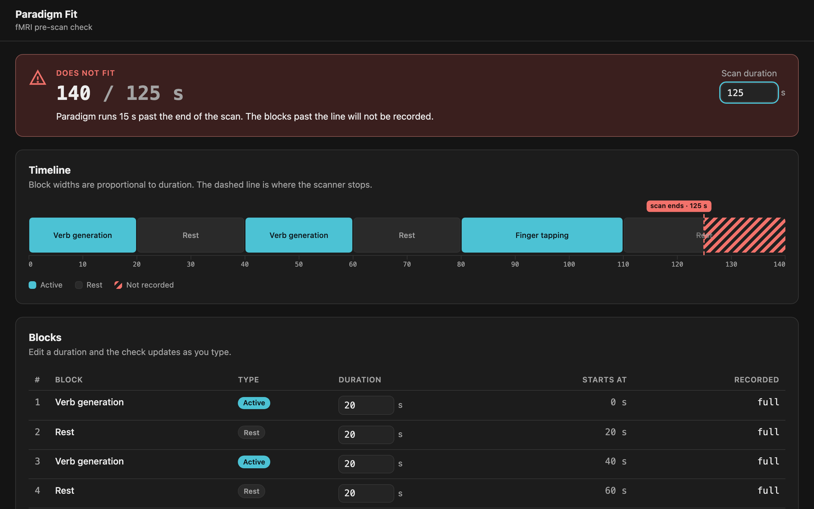

# paradigm-fit

Pre-scan check screen for a clinical operator: does an fMRI paradigm fit inside the programmed scan duration?
An fMRI paradigm is a sequence of timed blocks the patient follows while the scanner acquires images. The scanner stops when its programmed duration elapses, so a paradigm that runs longer loses its final blocks and the examination may have to be repeated with the patient still in the scanner. Today no automated check exists - the operator cross-checks against the scanner by hand, which is exactly why this screen is built like device software.



Built under a **V-model process**: a full design-control chain (user needs → clinical constraints → software requirements → architecture → detailed design), ISO 14971 risk analysis with a safety classification, a SOUP inventory, and tests at three levels, every one traced to a requirement or architecture ID in a generated traceability matrix.

## Layout

The application and the documentation are separate directories, each with its own toolchain.

```
app/     the Vue application: npm, Vite, Vitest, Playwright, ESLint
docs/    the documentation: MkDocs and a Python environment
```

The traceability matrix in `docs/content/verification/` is generated by a local script from the requirement tables, the `@requirement` tags in `app/src/` and the test titles; the script is not committed; the generated matrix is.

## Run

Prerequisites: Node 20 or later (`app/.nvmrc`); Python 3.11 or later only for the documentation site.

```sh
cd app
npm install
npx playwright install chromium   # once, for the system tests
npm run dev                       # http://localhost:5173
```

## Verify (from `app/`)

```sh
npm run lint             # eslint (layer boundaries, TSDoc, complexity) + prettier --check
npm run test:unit        # domain and ui units (node)
npm run test:component   # components and the state composable (jsdom + @vue/test-utils)
npm run test:e2e         # Playwright system tests against the production build
npm run test:coverage    # both Vitest projects with coverage thresholds
npm run build            # vue-tsc strict (sources and tests) + vite build
```

## Architecture

One bounded context, `src/paradigm/`, whose folders depend on the domain only, enforced by ESLint (see the [software architecture](docs/content/architecture/software-architecture.md)):

| Folder                                | Contents                                                                                      |
| ------------------------------------- | --------------------------------------------------------------------------------------------- |
| `paradigm/domain/`                    | The fMRI rules: paradigm timing, duration parsing, verdict, the check. Pure, imports nothing. |
| `paradigm/infrastructure/`            | The paradigm the build carries (`paradigm.json`) and its loader.                              |
| `paradigm/ui/`                        | Vue components, the `useParadigm` composable, and pure helpers for wording and view-models.   |
| `shared/`                             | Formatting; knows nothing about paradigms.                                                    |
| `App.vue`, `AppNavbar.vue`, `main.ts` | The composition root: loads the paradigm, provides the state, mounts the shell and navbar.    |

**Raw input strings are the only stored truth.** Every number, verdict and status is derived by one pure check function, so invalid input yields an explicit _Cannot check_ state rather than a verdict built on a substituted value. The runtime dependency is `vue` - the whole SOUP inventory - and the production build makes no external network requests (asserted by a system test).

## Documentation

The [documentation set](docs/content/index.md) is plain markdown (readable on GitHub) and also renders as an MkDocs site:

```sh
cd docs
python3 -m venv .venv              # takes a moment on first run while pip is set up
source .venv/bin/activate          # Windows: .venv\Scripts\activate
pip install -r requirements.txt
mkdocs serve                       # http://127.0.0.1:8000
```

`mkdocs build --strict` from the same directory writes the static site to `docs/site/`.

Start at the [development plan](docs/content/development/development-plan.md).

## How to audit the trace

1. Pick any requirement, e.g. `REQ-4` in [software requirements](docs/content/requirements/software-requirements.md).
2. Find its row in the [traceability matrix](docs/content/verification/traceability-matrix.md) - it lists the implementing files and the verifying test IDs.
3. Open that test in `app/tests/` and run the suite.
4. Every requirement statement is hashed in `docs/content/trace-clearances.json`; a changed statement makes its row **suspect** until its tests are re-read and the hash re-accepted, so the git diff of that file is the review record.

## Out of scope

Creating, deleting and reordering blocks, persistence, scanner integration.
