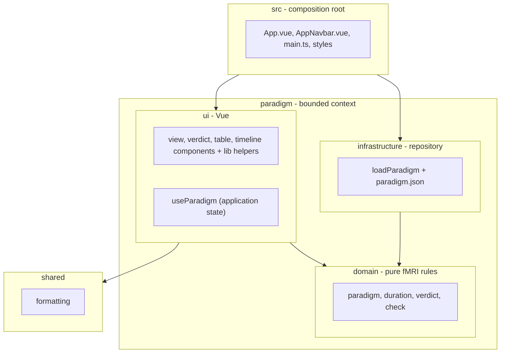

# Software Architecture

The code is one feature folder, `paradigm/`, with three parts: `domain` (the rules), `infrastructure` (the data), `ui` (the screen). Both `infrastructure` and `ui` depend on `domain`; nothing inside `paradigm/` depends on them. A second feature would be a sibling folder with the same shape.

## Layers

`App.vue` is the only file that knows both `infrastructure` and `ui`: it loads the paradigm and hands it to the state.

## Decisions

Each row is a choice a reviewer could argue with. File-by-file detail is in the [detailed design](detailed-design.md).

| ID                              | Statement                                                                                                                                                                      | Traces up                                                                    |
| ------------------------------- | ------------------------------------------------------------------------------------------------------------------------------------------------------------------------------ | ---------------------------------------------------------------------------- |
| ARCH-1 | All fMRI maths and validation live in `domain/`, plain TypeScript with no Vue and no imports from other folders. Components only do layout maths.                              | [RC-1](../risk/risk-analysis.md#rc-1)                                        |
| ARCH-2 | One composable, provided at the app root, holds all state. It stores only what the operator typed; every number and verdict is derived from one check result and never stored. | [RC-2](../risk/risk-analysis.md#rc-2), [RC-3](../risk/risk-analysis.md#rc-3) |
| ARCH-3 | Vue is the only runtime dependency (SOUP-1). The built app makes no requests to external hosts.                                                                                | -                                                                            |
| ARCH-5 | One loader reads the paradigm file. The state takes the paradigm as an argument, so tests run on in-memory data.                                                               | [REQ-7](../requirements/software-requirements.md#req-7)                      |

## Import rules

| Folder                                | May import                  | May never import             |
| ------------------------------------- | --------------------------- | ---------------------------- |
| `paradigm/domain`                     | nothing                     | any other folder, Vue        |
| `paradigm/infrastructure`             | `paradigm/domain`           | `paradigm/ui`, `shared`, Vue |
| `paradigm/ui`                         | `paradigm/domain`, `shared` | `paradigm/infrastructure`    |
| `shared`                              | nothing from `paradigm`     | `paradigm/**`                |
| `App.vue`, `AppNavbar.vue`, `main.ts` | everything                  | -                            |

ESLint enforces these rules (`no-restricted-imports`, one block per folder), so `npm run lint` fails on a violation. Tests are outside `src/` and may import anything.
